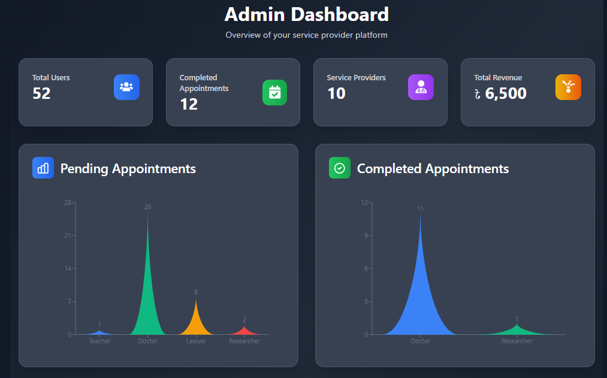
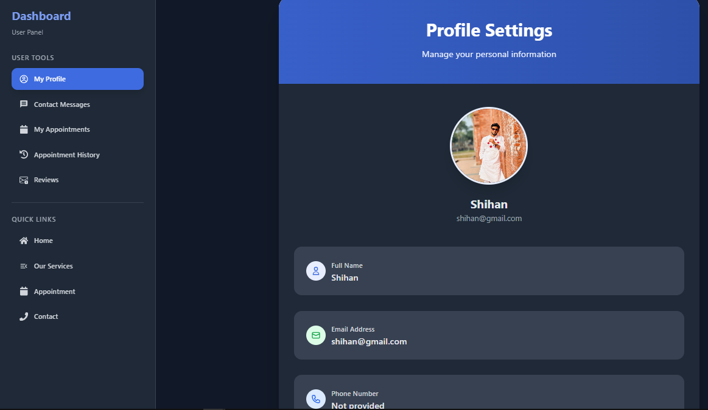
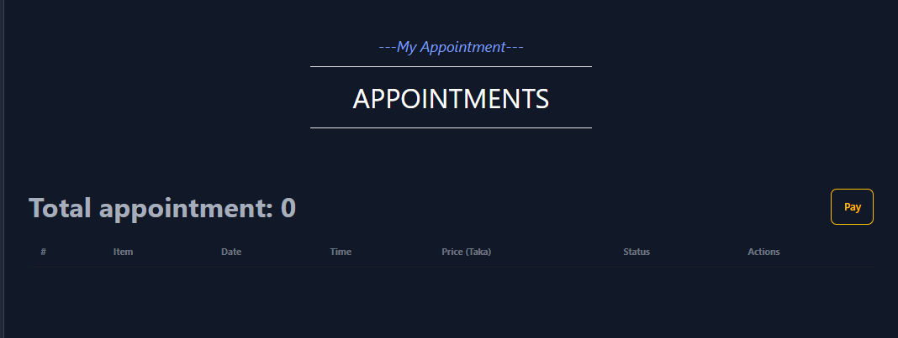

# Service Provider - Frontend Documentation

[](https://react.dev/)
[](https://vitejs.dev/)
[](https://tailwindcss.com/)
[](https://firebase.google.com/)
[](LICENSE)
[](https://github.com/)

---

## 🎯 Project Overview

**Service Provider** is a modern, responsive **React web application** that powers the user-facing interface of a comprehensive service marketplace platform. It enables users to discover service providers, book appointments, complete secure payments, track bookings in real-time, and connect with providers through integrated video conferencing.

Built with **React**, **Vite**, and **Tailwind CSS**, the frontend delivers a seamless, intuitive user experience with responsive design that works flawlessly across all devices. The application integrates with Firebase for authentication, connects to a robust Express.js backend API, and features real-time video conferencing powered by Zego UI Kit.

---

## 🌐 Live Demo

**🚀 Frontend Application:** [](https://service-provider-8c9f8.web.app)

**📡 Backend API:** [https://service-provider-server-cyan.vercel.app](https://service-provider-server-cyan.vercel.app)

**📱 Responsive Design:** Works perfectly on mobile, tablet, and desktop

---

## ✨ Key Features

### 🔐 **Authentication & User Management**

- Firebase-based authentication (Email/Password, Google Sign-in)
- User role management (Customer, Service Provider, Admin)
- Persistent user sessions with secure token handling
- Profile management with photo uploads via Cloudinary
- Account settings and preferences customization

### 🏢 **Service Provider Discovery**

- Browse service providers by category and specialization
- Advanced search and filtering (location, rating, availability)
- Provider profile pages with qualifications and experience
- Top-rated provider recommendations
- Real-time provider availability status

### 📅 **Appointment Booking System**

- Intuitive appointment booking interface with date/time selection
- Real-time availability checking
- Multiple appointment management (view, reschedule, cancel)
- Appointment status tracking (pending, confirmed, in-progress, completed)
- Appointment history with detailed records

### 💳 **Secure Payment Processing**

- Seamless SSLCommerz payment gateway integration
- Multiple payment method support (Visa, Mastercard, AmEx)
- Real-time payment status updates with UI feedback
- Automated receipt generation
- Payment history and transaction records

### 🎥 **Real-Time Video Conferencing**

- Integrated Zego UI Kit for professional video calls
- One-click joining for virtual appointments
- Screen sharing and recording capabilities
- Low-latency, high-quality audio/video
- Meeting room management with secure links

### ⭐ **Reviews & Ratings**

- Submit ratings and reviews after appointments
- View detailed provider ratings and feedback
- Sort and filter reviews by date and rating
- Community-driven provider credibility system
- Star rating visualization

### 📊 **User Dashboard**

- Personalized dashboard with appointment overview
- Upcoming and past appointments at a glance
- Appointment analytics and statistics
- Quick action buttons for common tasks
- Performance metrics for providers

### 📱 **Admin Panel**

- User management and role assignment
- Appointment monitoring and manual assignment
- Provider management and verification
- Revenue analytics and business insights
- Contact message management
- System statistics and health monitoring

### 📝 **Blog & Content Management**

- Browse blogs and articles from service providers
- Provider insights and tips
- Blog categories and search functionality
- Reading time estimation
- Share and engagement features

### 📐 **Responsive & Accessible Design**

- Mobile-first responsive layout (works on all devices)
- Accessibility-first component design (WCAG 2.1 compliant)
- Fast load times with Vite's optimal bundling
- Progressive Web App (PWA) ready
- Smooth animations and transitions

---

## 🛠 Tech Stack

### **Frontend Framework & Build Tool**

| Technology      | Version | Purpose                                  |
| --------------- | ------- | ---------------------------------------- |
| React           | 18.3.1  | UI library and component framework       |
| Vite            | 6.0.1   | Next-generation build tool with fast HMR |
| React Router    | 7.0.1   | Client-side routing and navigation       |
| React Hook Form | 7.54.2  | Efficient form state management          |

### **Styling & UI Components**

| Technology   | Version | Purpose                                    |
| ------------ | ------- | ------------------------------------------ |
| Tailwind CSS | 3.4.15  | Utility-first CSS framework                |
| DaisyUI      | 4.12.14 | Pre-built Tailwind components              |
| React Icons  | 5.3.0   | Icon library (Font Awesome, Feather, etc.) |
| PostCSS      | 8.4.49  | CSS post-processing                        |
| Autoprefixer | 10.4.20 | Vendor prefix automation                   |

### **State Management & Data Fetching**

| Technology                   | Version | Purpose                                   |
| ---------------------------- | ------- | ----------------------------------------- |
| TanStack Query (React Query) | 5.62.2  | Server state management and caching       |
| Axios                        | 1.7.8   | HTTP client for RESTful API calls         |
| React Helmet                 | 6.1.0   | Manage HTML head tags (meta, title, etc.) |

### **Authentication & Backend**

| Technology | Version | Purpose                            |
| ---------- | ------- | ---------------------------------- |
| Firebase   | 11.0.2  | Authentication, Firestore, Hosting |

### **Real-Time Communication**

| Technology  | Version | Purpose                              |
| ----------- | ------- | ------------------------------------ |
| Zego UI Kit | 2.14.1  | Video/audio conferencing integration |
| Swiper      | 11.1.15 | Carousel and slider components       |

### **Media & Content**

| Technology          | Version | Purpose                           |
| ------------------- | ------- | --------------------------------- |
| Cloudinary URL Gen  | 1.21.0  | Image optimization and management |
| React Image Resizer | 0.4.8   | Client-side image compression     |

### **UI Effects & Components**

| Technology       | Version | Purpose                           |
| ---------------- | ------- | --------------------------------- |
| React Tabs       | 6.0.2   | Tab navigation component          |
| React Rating     | 1.5.0   | Star rating component             |
| SweetAlert2      | 11.14.5 | Beautiful modal alerts            |
| React Typewriter | 5.0.1   | Typewriter text animation effects |
| Recharts         | 2.15.1  | Chart and data visualization      |

### **Code Quality & Development**

| Technology          | Version | Purpose                      |
| ------------------- | ------- | ---------------------------- |
| ESLint              | 9.15.0  | Code linting and quality     |
| ESLint React Plugin | 7.37.2  | React-specific linting rules |
| React Hooks ESLint  | 5.0.0   | React Hooks best practices   |

### **Deployment**

| Technology       | Purpose                        |
| ---------------- | ------------------------------ |
| Firebase Hosting | Production deployment platform |
| Git              | Version control                |

---

## 🏗 Architecture Overview

```
┌──────────────────────────────────────────────┐
│    React App with Vite Dev Server            │
├──────────────────────────────────────────────┤
│   React Router - Page Routing Layer          │
│   (Home, Providers, Dashboard, Admin, etc.)  │
├──────────────────────────────────────────────┤
│   Component Layer                            │
│   (Pages, Components built with Tailwind)    │
├──────────────────────────────────────────────┤
│   State & Data Layer                         │
│   (React Query, React Hook Form, Context)    │
├──────────────────────────────────────────────┤
│   Service Layer                              │
│   (Axios API calls, Firebase Auth)           │
├──────────────────────────────────────────────┤
│   External Integrations                      │
│   (Backend API, Firebase, Zego, Cloudinary)  │
└──────────────────────────────────────────────┘
```

### **Key Design Patterns**

- **Component-Based** — Reusable, composable UI components
- **Custom Hooks** — Encapsulated logic for API calls and state
- **React Query** — Server state management with caching
- **React Hook Form** — Optimized form handling
- **Firebase Integration** — Real-time auth and database
- **Responsive Design** — Mobile-first Tailwind CSS
- **Protected Routes** — Role-based route guards

---

## 📁 Project Structure

```
src/
├── main.jsx                      # React app entry point
├── App.jsx                       # Main component with routing
├── App.css                       # Global styles
│
├── pages/                        # Route pages
│   ├── Home.jsx                 # Landing page
│   ├── Providers.jsx            # Provider listing
│   ├── ProviderDetails.jsx      # Individual provider profile
│   ├── Appointment.jsx          # Appointment booking
│   ├── Dashboard.jsx            # User dashboard
│   ├── Profile.jsx              # User profile
│   ├── Blogs.jsx                # Blog listing
│   ├── BlogDetail.jsx           # Individual blog post
│   ├── AdminPanel.jsx           # Admin dashboard
│   ├── VideoCall.jsx            # Video conference room
│   ├── Login.jsx                # Login page
│   ├── Register.jsx             # Registration page
│   └── NotFound.jsx             # 404 page
│
├── components/                  # Reusable components
│   ├── Navbar.jsx              # Top navigation
│   ├── Footer.jsx              # Footer section
│   ├── ProviderCard.jsx        # Provider display card
│   ├── AppointmentCard.jsx     # Appointment display card
│   ├── ReviewCard.jsx          # Review display card
│   ├── LoadingSpinner.jsx      # Loading indicator
│   ├── Modal.jsx               # Modal dialog
│   ├── Form/
│   │   ├── LoginForm.jsx
│   │   ├── RegisterForm.jsx
│   │   ├── BookingForm.jsx
│   │   └── ProfileForm.jsx
│   ├── Admin/
│   │   ├── UserManagement.jsx
│   │   ├── AppointmentManagement.jsx
│   │   └── Analytics.jsx
│   └── ...
│
├── hooks/                       # Custom React hooks
│   ├── useAuth.js              # Authentication hook
│   ├── useApi.js               # API calls hook
│   ├── useFetch.js             # Data fetching with React Query
│   └── useForm.js              # Form handling
│
├── services/                    # API and service functions
│   ├── api.js                  # Axios client setup
│   ├── firebaseConfig.js       # Firebase initialization
│   ├── authService.js          # Auth functions
│   ├── appointmentService.js   # Appointment operations
│   ├── providerService.js      # Provider operations
│   └── ...
│
├── utils/                       # Utility functions
│   ├── validators.js           # Form validation
│   ├── formatters.js           # Date, currency formatters
│   ├── constants.js            # App constants
│   └── helpers.js              # Helper functions
│
├── context/                     # React Context (if used)
│   ├── AuthContext.jsx
│   └── AppContext.jsx
│
├── styles/                      # Global styles
│   └── index.css
│
└── assets/                      # Static assets
    ├── images/
    ├── icons/
    └── ...
```

---

## 📡 Main Routes & Pages

| Route                      | Component       | Description                          | Auth     |
| -------------------------- | --------------- | ------------------------------------ | -------- |
| `/`                        | Home            | Landing page with featured providers | ❌       |
| `/providers`               | Providers       | Browse all service providers         | ❌       |
| `/provider/:id`            | ProviderDetails | Provider profile and reviews         | ❌       |
| `/appointment/:providerId` | Appointment     | Book appointment                     | ✅       |
| `/dashboard`               | Dashboard       | User bookings and history            | ✅       |
| `/dashboard/video/:roomId` | VideoCall       | Virtual meeting room                 | ✅       |
| `/profile`                 | Profile         | User settings                        | ✅       |
| `/blogs`                   | Blogs           | Browse provider articles             | ❌       |
| `/blog/:id`                | BlogDetail      | Single blog post                     | ❌       |
| `/admin`                   | AdminPanel      | Admin dashboard                      | ✅ Admin |
| `/login`                   | Login           | User login                           | ❌       |
| `/register`                | Register        | User registration                    | ❌       |

---

## 📸 Screenshots

### Admin Dashboard



### User Profile



### Provider Profile



---

## 🔄 User Flows

### **User Registration**

```
1. Click "Register" on homepage
2. Enter email, password, name, phone
3. Form validation on client-side
4. Submit to Firebase Authentication
5. User account created
6. Auto-login user
7. Redirect to dashboard
```

### **Booking an Appointment**

```
1. Browse providers → Click provider name
2. View profile, reviews, availability
3. Click "Book Appointment" button
4. Select date, time, and service
5. Confirm booking details
6. Payment required → SSLCommerz gateway
7. Complete payment
8. Appointment confirmed
9. Email notification sent
```

### **Video Appointment Meeting**

```
1. Appointment time arrives
2. User receives notification
3. Click "Join Meeting" → Video room
4. Zego UI Kit initializes
5. Wait for provider to join
6. Provider joins from their end
7. Video call begins
8. Use features: record, share screen, chat
9. After call → Rating and review prompt
```

### **Admin Management**

```
1. Login as admin
2. Access admin panel
3. View statistics and analytics
4. Manage users, appointments, providers
5. Respond to contact messages
6. Monitor platform health
```

---

## 🔮 Future Enhancements

1. **Offline Support** — Service Worker + IndexedDB
2. **Mobile App** — React Native version
3. **Push Notifications** — Firebase Cloud Messaging
4. **AI Recommendations** — Smart provider suggestions
5. **Real-time Chat** — WebSocket messaging system
6. **Advanced Analytics** — User behavior tracking
7. **Dark Mode** — Theme switching capability
8. **Multi-language** — i18n internationalization

---

## 📱 Browser Support

| Browser       | Support           |
| ------------- | ----------------- |
| Chrome        | Latest 2 versions |
| Firefox       | Latest 2 versions |
| Safari        | Latest 2 versions |
| Edge          | Latest 2 versions |
| Mobile Chrome | Latest            |
| Mobile Safari | Latest            |

---

## 📝 License

ISC License — See [LICENSE](LICENSE) file

---

## 👨‍💻 Author

**Mahmudul Hasan Shihan**

- **LinkedIn:** [mh-shihan](https://www.linkedin.com/in/mh-shihan/)
- **GitHub:** [mh-shihan](https://github.com/mh-shihan)
- **Portfolio:** [shihandev.com](https://shihandev.com)

---

**Made with ❤️ by Shihan**
